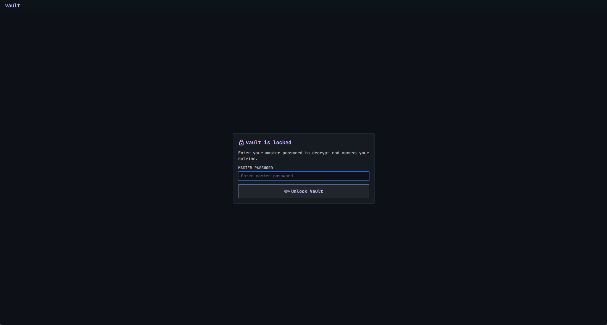
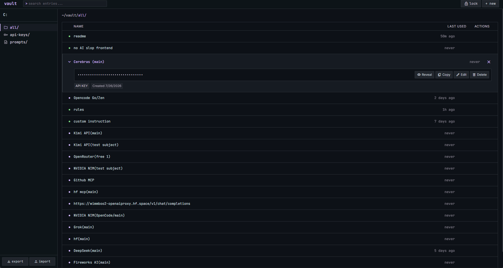

# Vault

A single-file, client-side encrypted vault for API keys and prompts. No backend, no build step — just open `index.html` in a browser.

## What can it do?



- **Encrypt at rest** — all entries are encrypted with AES-256-GCM before touching localStorage; the master key stays in memory and is never persisted
- **API keys & prompt templates** — two entry types with category filtering (all / api-keys / prompts)
- **Smart masking** — values are masked by default, preserving key prefixes (`sk-`, `sk-ant-`, `sk-proj-`) so you know which key is which without revealing it
- **Copy to clipboard** — one click copies the plaintext value and bumps the "last used" timestamp
- **CRUD entries** — create, edit, delete (with a two-click confirmation to avoid accidents)
- **Search** — full-text search across entry names
- **Encrypted backups** — export is encrypted with a passphrase of your choosing and carries its own salt, so it restores on any machine; plaintext export is available but must be opted into explicitly
- **Auto-lock on idle** — the vault locks itself after a configurable idle period, with a 30-second warning first
- **Rotation reminders** — give an entry a rotation period and it is flagged in the list (and in a `rotate/` view) once it comes due
- **Password generator** — CSPRNG-backed, with length, character sets, and a look-alike filter; available anywhere a value or passphrase is entered
- **Strength meter** — live entropy estimate on the master password and backup passphrases
- **Reveal toggle** — temporarily show a password you are typing; it hides itself again after 10 seconds
- **Keyboard-first** — `ctrl+K` command palette, `/` to search, `N` for a new entry, `ctrl+L` to lock, `?` for the full list
- **Responsive layout** — sidebar navigation on desktop, horizontal category tabs on mobile



## How it works

### Architecture

The entire application is a single HTML file. There is no framework, no bundler, no server.

Plain JavaScript calls the [Web Crypto API](https://developer.mozilla.org/en-US/docs/Web/API/Web_Crypto_API) directly for all cryptographic operations. Tailwind CSS (loaded from CDN) handles styling. Everything else — routing, state management, rendering — is vanilla JS.

### Data flow

```
[user types master password]
        |
        v
PBKDF2 (SHA-256, 600k iterations, 16-byte random salt)
        |
        v
AES-256-GCM key (in-memory CryptoKey, never serialized)
        |
        v
localStorage: encrypted JSON blob  <--->  entries array (in memory)
```

1. **Setup** — on first use, a 16-byte random salt is generated and stored in localStorage. The user's password is fed through PBKDF2 to derive an AES-256-GCM key. A known validation string is encrypted and stored to verify the password on future unlocks. The iteration count is recorded alongside the salt so it can be raised later without locking existing vaults out.

2. **Unlock** — the stored salt and validation ciphertext are read back. The password is re-derived at the vault's recorded iteration count and used to decrypt the validation string. If it matches, the vault opens. A vault still on an older iteration count is re-keyed at this point (see *Key derivation parameters* below).

3. **Session** — entries live as a plain JavaScript array in memory and are rendered as HTML strings. On any write (create, edit, delete, import), the full array is serialized to JSON, encrypted with the active key, and written back to localStorage.

4. **Lock** — the CryptoKey is set to `null`, the entries array is cleared, and the app returns to the unlock screen. The encrypted data remains in localStorage. Locking happens on demand, on `ctrl+L`, or automatically after the configured idle period.

### Key derivation parameters

The iteration count lives in localStorage under `vault_kdf_params` rather than being hardcoded at the call site. A vault with no such record predates the change and is assumed to be at the original 100,000 iterations.

On a successful unlock, if the vault's recorded count is below the current target (600,000, per OWASP guidance for PBKDF2-SHA256), the vault is re-keyed in place: a new key is derived at the higher count, and the validation token and entry blob are re-encrypted under it. Every crypto operation completes before the first `localStorage` write, so a failure part-way through leaves the old — still valid — vault untouched. The upgrade costs roughly half a second, once.

### Entry model

```js
{
  id: 'entry-1715000000000',
  name: 'openai_key.env',
  type: 'api-key',   // or 'prompt'
  value: 'sk-proj-...',
  createdAt: 1715000000000,
  lastUsedAt: 1715100000000,
  rotateDays: 90,             // 0 = no rotation reminder
  rotatedAt: 1715000000000    // clock restarts when the value changes
}
```

### Import/export

Exports are encrypted. The file is a JSON object holding the app name, format version, ISO export timestamp, entry count, the KDF parameters used, and the ciphertext:

```js
{
  app: 'Vault',
  version: 2,
  encrypted: true,
  exportedAt: '2026-01-01T00:00:00.000Z',
  entryCount: 12,
  kdf:    { name: 'PBKDF2', hash: 'SHA-256', iterations: 600000, salt: '<base64>' },
  cipher: { name: 'AES-GCM', iv: '<base64>', ciphertext: '<base64>' }
}
```

The backup passphrase is independent of the master password and the file embeds its own salt, so a backup restores on a machine that has none of this vault's localStorage. Import detects the encrypted format and prompts for the passphrase; it still accepts the v1 wrapped format and a raw array, so older backups keep working. Either way it resolves ID collisions by re-generating IDs and appends to the existing vault.

A cleartext export is still available behind an explicit opt-in checkbox, and the file it produces is named `..._CLEARTEXT.json` so it is obvious what it is.

## What did I personally figure out?

**CryptoKey is non-serializable.** The Web Crypto API returns `CryptoKey` objects as opaque handles — you can't `JSON.stringify` them, and you can't store them in localStorage. The decision to keep the key purely in memory and re-derive it on every unlock is forced by the platform, but it also means there's no key material sitting on disk, ever.

**Password verification without storing the password.** Rather than hashing the password and comparing, the vault encrypts a known validation string (`VAULT_AUTH_VERIFIED_V1`) with the derived key. On unlock, it attempts decryption — if the result matches the known string, the password is correct. This avoids storing a separate password hash and reuses the same encryption path for verification.

**Legacy data migration.** An early iteration stored entries unencrypted under a `vault_entries` key. The setup flow checks for this legacy key and migrates its contents into the encrypted store, then removes the plaintext storage so no unencrypted data remains behind.

**Smart masking that preserves prefixes.** A simple `maskValue` function examines the value instead of blindly replacing everything. If it starts with `sk-ant-`, `sk-proj-`, or `sk-`, those prefixes are shown in full and only the remainder is masked. This matters because when you have multiple API keys from different providers, the prefix tells you which is which at a glance — you don't have to reveal the full key or memorize which entry corresponds to which service.

**Two-click delete.** Accidental deletion of an API key could mean revoking and rotating a production key. The delete button first says "Delete", then on click it changes to "Confirm?" — only a second click executes the deletion. A different icon (`help_outline` vs `delete`) and error-colored styling on the second state make the intent shift unambiguous.

**Tailwind via CDN with a custom design token system.** Rather than using Tailwind's default utility classes directly, the entire color palette is defined as named semantic tokens in the Tailwind config (`primary`, `secondary`, `surface`, `on-surface`, `surface-container`, etc.) following Material Design 3 naming conventions. This means the single-file app has a real design system — changing the palette is a matter of editing the Tailwind config block, not hunting through every class name.

## How do I run it?

No dependencies. No install step. No build.

1. Clone the repo
2. Open `index.html` in any modern browser (Chrome, Firefox, Safari, Edge)
3. Set your master password on the setup screen
4. Start adding entries

The CDN-loaded assets (Tailwind, Google Fonts, Material Symbols) will load automatically on first open. After that, everything runs locally — the encrypted data never leaves your browser.

## License

MIT
